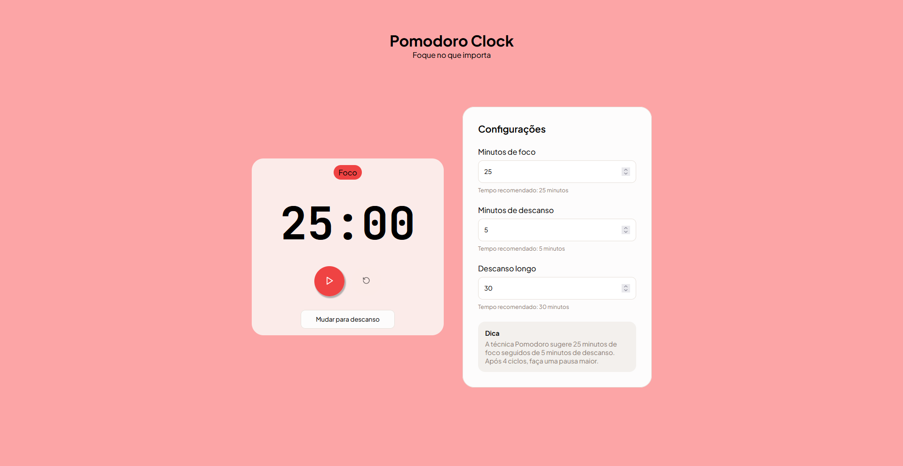
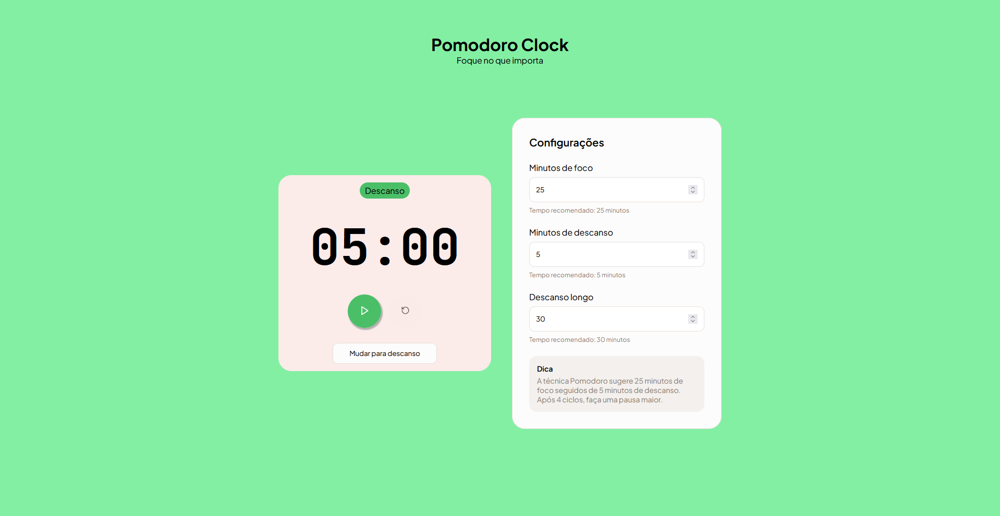

# 🕒 Pomodoro Clock

Um timer simples, bonito e funcional baseado na técnica Pomodoro — desenvolvido em **HTML, CSS e JavaScript puro**.

A aplicação permite configurar minutos de foco e descanso, iniciar uma contagem regressiva e alternar automaticamente entre os ciclos.  
O objetivo é ajudar você a manter produtividade com uma interface agradável e intuitiva.

---

## 🎮 Gamificação (feature futura)

Uma das ideias principais deste projeto é evoluir o Pomodoro Clock para um sistema **gamificado**, tornando o hábito de produtividade mais divertido e recompensador.

Planejamento da gamificação:

- 🆙 **Sistema de XP**  
  Cada pomodoro concluído concede uma quantidade de experiência ao usuário.

- 🎁 **Bônus por marcos especiais**  
  Após determinados números de pomodoros (ex: 4, 10, 25...), o usuário recebe mais XP ou recompensas especiais.

- 🎖 **Níveis de conta**  
  Conforme acumula XP, o usuário sobe de nível, desbloqueando novos conteúdos.

- 🏅 **Cosméticos desbloqueáveis**  
  Ao progredir, o usuário poderá ganhar:
  - Badges exclusivas
  - Temas visuais alternativos
  - Ícones especiais para o timer
  - Efeitos e animações personalizáveis

O objetivo é transformar a rotina de estudos/trabalho em uma experiência mais engajadora, motivando o usuário a continuar usando a técnica diariamente.

---

## 📸 Demonstração

### Modo Foco

### Modo Descanso

---

## ✨ Funcionalidades

### ✔ Implementadas

- ✔ Validação de input (mínimo/máximo)
- ✔ Exibição de erros específicos nos campos
- ✔ Formatação do tempo (mm:ss)
- ✔ Iniciar / Pausar o timer
- ✔ Resetar o timer
- ✔ Bloquear inputs enquanto o timer está rodando
- ✔ Alternância entre ícone de Play/Pause
- ✔ Timer regressivo com `setInterval`
- ✔ Exibição dinâmica do tempo no display
- ✔ Alternância manual entre foco e descanso
- ✔ Alternância automática foco → descanso → foco
- ✔ Intervalo não é reiniciado ao trocar o valor dos inputs

### ⏳ Em desenvolvimento / Planejado

- 🔄 Sons de alerta (início / fim do timer)
- 📊 Barra visual de progresso
- 📘 Histórico de sessões concluídas
- 🧹 Limpar mensagens de erro automaticamente
- 🌙 Tema escuro/claro
- 🔢 Contagem de ciclos (Pomodoros)
- ⏭ Botão "Pular descanso"
- 🔔 Notificações do navegador (API Notification)
- 💾 Salvar configurações no LocalStorage
- 🛋 Descanso longo personalizável após X ciclos
- 📱 Melhor responsividade para mobile

---

## 🚀 Como usar

Você pode acessar a aplicação diretamente pelo GitHub Pages no link abaixo:

👉 **Acesse aqui:** https://raulaugusto.github.io/Pomodoro_Clock/

(Substitua pelo link real do seu projeto.)

---

## 🧠 Tecnologias utilizadas

- **HTML5**
- **CSS3**
- **JavaScript Vanilla**
- **Google Fonts**
- **LocalStorage (em breve)**

---

## 🧭 Roadmap de Melhorias

- Adicionar suporte a **descanso longo automático** após 4 ciclos
- Criar um **dashboard de produtividade** com estatísticas
- Exportar histórico para CSV
- Animações sutis no timer
- Ajustes finos de acessibilidade (teclas de atalho, ARIA labels)
- Layout otimizado para telas menores
- Mostrar progresso com animação circular
- Criar opção de **alarme customizado**
- Criar um **modo compacto** para usar enquanto trabalha

---

## 💡 Sugestões adicionais

- Transformar em **PWA** para instalar no celular
- Rodar o timer mesmo com aba minimizada via Service Worker
- Temas customizáveis
- Integração com Text-to-Speech (“Hora de descansar!”)
- Widget minimalista de borda de tela
